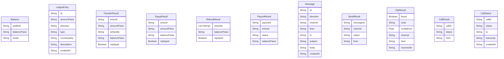

# Schema

```mermaid
erDiagram

  Balance {
    String walletId
    String balancePaise
    String mode
  }

  LedgerEntry {
    String id
    String amountPaise
    String direction
    String type
    String counterparty
    String description
    String createdAt
  }

  TransferResult {
    String entryId
    String amountPaise
    String toHandle
    String balancePaise
    Boolean replayed
  }

  TopupResult {
    String entryId
    String amountPaise
    String balancePaise
    Boolean replayed
  }

  RefundResult {
    List~String~ entryIds
    String balancePaise
    Boolean replayed
  }

  PayoutResult {
    String payoutId
    String entryId
    String status
    String balancePaise
  }

  Message {
    String id
    String direction
    String channel
    String from
    String to
    String subject
    String body
    String createdAt
  }

  SendResult {
    String messageId
    String channel
    String status
    String from
  }

  OtpResult {
    Boolean found
    String code
    Float confidence
    String channel
    String from
    String receivedAt
  }

  CallResult {
    String callId
    String status
    String from
  }

  CallStatus {
    String callId
    String status
    String to
    String transcript
    String createdAt
  }
```
