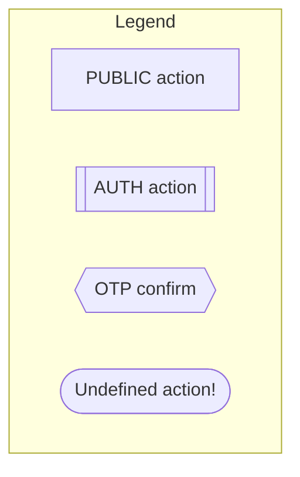

# System Flow

```mermaid
flowchart TD

  subgraph Legend
    legend_pub["PUBLIC action"]
    legend_auth[["AUTH action"]]
    legend_otp{{"OTP confirm"}}
    legend_undef(["Undefined action!"])
  end
```
